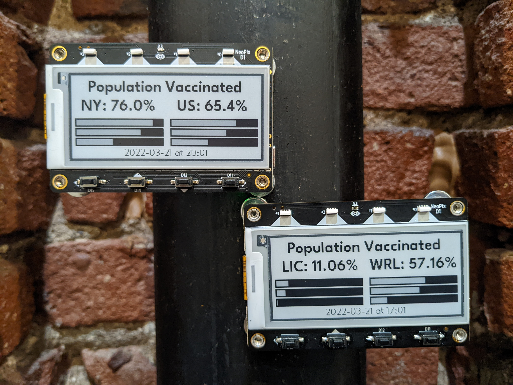
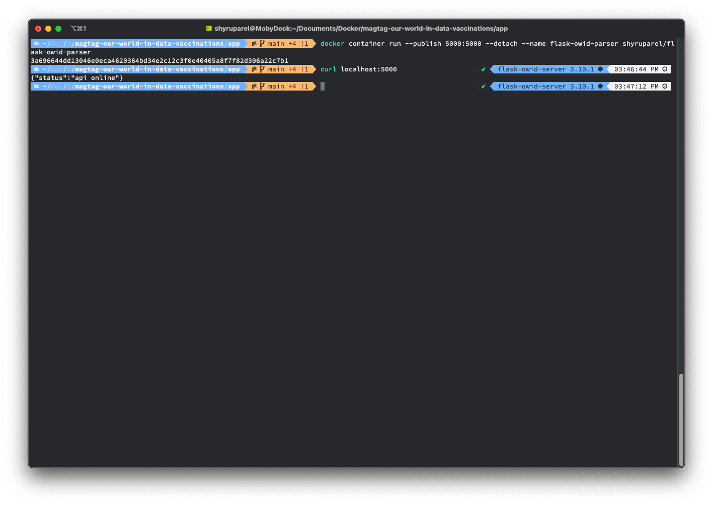
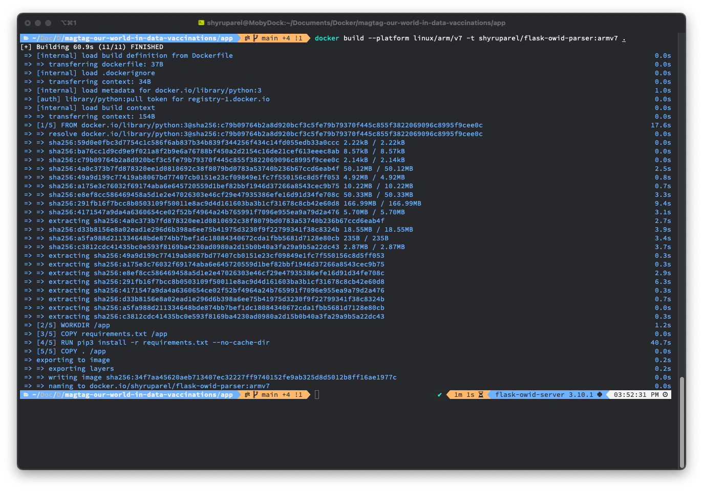
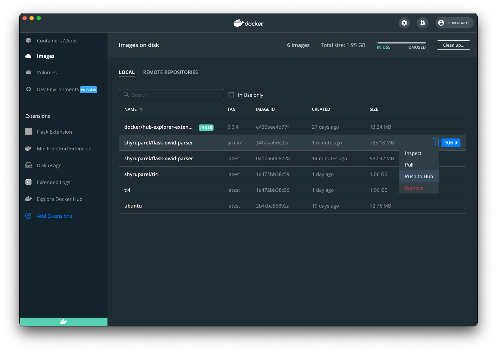

Showcasing the OWID Vaccination Data with E-Ink, Docker, CircuitPython and IoT
=====

Check out a full write up about this project on the [Docker Blog](Todo)



What is this about?
=====

The folks at Our World in Data maintain a [Dataset about Covid-19](https://github.com/owid/covid-19-data). Out of personal curiosity I've been watching the [vaccination rates](https://github.com/owid/covid-19-data/tree/master/public/data/vaccinations) that they've been publishing over the last year. I've worked on project utilizing the [Adafruit Magtag](https://github.com/Shy/MagTag-Contentful-Courier) in the past and decided to repurpose them to watch the vaccination rates.

Unfortunately the JSON file provided by OWID is 34 MB while the MagTag itself only has 2 MB of PSRam. Utilizing Docker, I've created a flask server that parsers the data from OWID and formats it the minimal amount that the MagTag needs to render out it's progress bars. By using Docker I'm able to write the code on my Macbook, build it for the ARMv7 platform the Raspberry pi uses and then deploy it to a Pi that sits on my local network.

Each MagTag updates daily at 8pm ET.

Getting started
=====

### Requirements

To deploy this project you'll need accounts for the following services:

- [Docker](https://hub.docker.com/)

You'll also need the following hardware.
- Adafruit MagTag. I recommend the [starter bundle](https://www.adafruit.com/product/4819) as it comes with the device, magnetic standoffs and a battery.
- Raspberry Pi. I used a Pi 3 Model B.

### Setup

* Fork and clone this repository
#### The Flask Server part
If you'd like to build and run the Docker image yourself, navigate to the app directory and run the following.

```bash
docker build --tag {yourdockerusernamehere}/flask-owid-parser:latest .
docker container run --publish 5000:5000 --detach --name flask-owid-parser {yourdockerusernamehere}/flask-owid-parser
```



To build the image to run on the raspberry rebuild it with the armv7 platform selected.

```bash
docker build --platform linux/arm/v7 -t {yourdockerusernamehere}/flask-owid-parser:armv7 .
```



Push your build up to Docker Hub using either the CLI or Docker Desktop.



Over on your raspberry pi, pull the image (either one you've built or mine) and then run it.

```bash
docker pull {yourdockerusernamehere or shyruparel}/flask-owid-parser:armv7
docker run -d -p 5000:5000 --name flask-owid-parser shyruparel/flask-owid-parser:armv7"
```


#### The MagTag part

##### MagTag Setup

For this project I've used the [Progress Bar Adafruit MagTag](https://learn.adafruit.com/magtag-progress-displays/progressbar-basics) tutorial as a starting point. Follow the instructions in their overview guide to setup [Circuit Python](https://learn.adafruit.com/magtag-progress-displays/progressbar-basics). If this is the first project you're using your MagTag with, I'd encourage you to check out the [Adafruit getting started guide](https://learn.adafruit.com/magtag-progress-displays/overview) and then revisit this tutorial once you've had a chance to read their overview of the board. I've prepackaged the libaries, and fonts used in the example into this GitHub repo.

##### Installing the code to the MagTag
Attach the MagTag your computer and make sure that the CircuitPython drive is mounted. The MagTag will need to be switched on and you'll have to hit the reset button for it to connect to your computer. Modify the secrets.py file so it utilizes your wifi network and then copy everything in the src directory to the root of your MagTag.


Once everything saves the Magtag will soft reboot, connect to the Raspberry Pi API and display a progress bar with updated data.

Learn More
=======

Check out the full project write up on the [Docker Blog]().

Learn more about getting started with [Docker and Python](https://docs.docker.com/language/python/build-images/)

License
=======

Code released under the MIT license. See [licence.md](licence.md) for further details.
